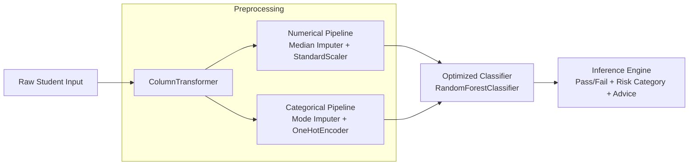

# 🎓 Student Academic Performance Machine Learning Project

[](https://www.python.org/downloads/)
[](https://scikit-learn.org/)
[](https://opensource.org/licenses/MIT)

An end-to-end, production-ready Machine Learning system engineered to predict student academic outcomes (`Pass` vs `Fail`), quantify academic risk factors, and generate actionable academic interventions.

---

## 📁 Project Structure

```text
student_ml_project/
├── data/
│   └── raw/
│       └── student_performance.csv          # Raw student performance dataset (300 records)
├── notebooks/
│   └── student_model_optimization.ipynb     # Interactive Jupyter notebook with EDA & hyperparameter tuning
├── models/
│   └── student_pass_model.pkl               # Serialized end-to-end tuned Scikit-Learn inference pipeline
├── reports/
│   ├── feature_importance.csv               # Ranked feature importance scores
│   └── model_comparison.csv                 # Multi-algorithm performance benchmark report
├── src/
│   ├── __init__.py                          # Package initialization
│   └── predict.py                           # Production inference engine with CLI & batch support
├── requirements.txt                         # Pinned Python package dependencies
└── README.md                                # Project documentation and operational guide
```

---

## 🔬 Dataset Overview

The dataset (`data/raw/student_performance.csv`) represents student cohort academic data with continuous assessments, study habits, and demographic attributes:

| Column | Type | Description |
| :--- | :--- | :--- |
| `StudentID` | `String` | Unique student identifier (e.g. `S001`) |
| `Age` | `Integer` | Student age (18 - 25) |
| `Gender` | `Category` | Gender (`Male`, `Female`) |
| `Department` | `Category` | Department (`Computer Science`, `Commerce`, `Mathematics`, `Physics`, `Engineering`) |
| `StudyHours` | `Float` | Average daily study hours (1.0 - 9.5 h/day) |
| `Attendance` | `Float` | Class attendance percentage (50.0% - 99.0%) |
| `AssignmentScore` | `Integer` | Continuous assignment score (30 - 98) |
| `PreviousExamScore` | `Integer` | Midterm / Previous exam score (25 - 98) |
| `PracticeTestScore` | `Integer` | Mock test score (25 - 98) |
| `FinalMarks` | `Float` | Final composite course marks (0.0 - 100.0) |
| `Pass` | `Binary` | Target outcome: `1` = Pass ($\ge 50$ marks), `0` = Fail ($< 50$ marks) |

---

## 🏗️ Pipeline Architecture

The pipeline strictly prevents data leakage by bundling feature transformations and estimator in a single `Pipeline`:



---

## 📊 Benchmark & Model Comparison

6 machine learning algorithms were benchmarked using **5-Fold Stratified Cross-Validation** and evaluated on an independent 20% holdout test set:

| Model | CV Mean Acc | Test Accuracy | Precision | Recall | F1-Score | ROC-AUC |
| :--- | :---: | :---: | :---: | :---: | :---: | :---: |
| **Random Forest (Tuned)** | **0.9542** | **0.9833** | **1.0000** | **0.9792** | **0.9895** | **0.9965** |
| **Logistic Regression** | 0.9583 | 0.9667 | 0.9600 | 1.0000 | 0.9796 | 0.9983 |
| **Decision Tree** | 0.9125 | 0.9667 | 1.0000 | 0.9583 | 0.9787 | 0.9792 |
| **Support Vector Machine** | 0.9625 | 0.9500 | 0.9592 | 0.9792 | 0.9691 | 0.9878 |
| **K-Nearest Neighbors** | 0.9667 | 0.9500 | 0.9787 | 0.9583 | 0.9684 | 0.9852 |
| **Gradient Boosting** | 0.9500 | 0.9333 | 0.9400 | 0.9792 | 0.9592 | 0.9913 |

---

## 🧠 Feature Importance Insights

Top predictive features ranked by Gini Importance (Mean Decrease in Impurity):

| Rank | Feature | Importance Weight | Impact |
| :---: | :--- | :---: | :--- |
| **1** | `PreviousExamScore` | **37.89%** | Primary foundational knowledge baseline |
| **2** | `AssignmentScore` | **21.35%** | Continuous academic discipline |
| **3** | `PracticeTestScore` | **19.95%** | Test readiness and exam preparation |
| **4** | `StudyHours` | **10.55%** | Dedicated learning effort |
| **5** | `Attendance` | **6.04%** | Lecture participation & retention |
| **6** | `Age` / Demographic | **4.22%** | Minor secondary variance |

---

## 🚀 Quickstart & Installation

### 1. Prerequisites & Setup
Clone the repository and install dependencies:
```bash
pip install -r requirements.txt
```

### 2. Retraining the Pipeline
To re-run the full training, hyperparameter tuning, report generation, and model export:
```bash
python student_ml_project/train_pipeline.py
```

### 3. Running the Jupyter Notebook
Open the interactive EDA and modeling notebook:
```bash
jupyter notebook student_ml_project/notebooks/student_model_optimization.ipynb
```

---

## 🔮 Production Inference with `src/predict.py`

### 1. Run Sample Demonstration
```bash
python student_ml_project/src/predict.py --sample
```
**Example Output:**
```text
[Student ID: DEMO-001] - Computer Science (Female, 21y)
  Study: 8.5h/d | Attendance: 94.0% | Avg Score: 90.0
  --> Prediction:       PASS
  --> Pass Likelihood:  99.98%
  --> Risk Category:    Low Risk
  --> Recommendations:
      - Excellent academic standing! Maintain consistent study habits.

[Student ID: DEMO-003] - Physics (Male, 20y)
  Study: 1.5h/d | Attendance: 52.0% | Avg Score: 33.3
  --> Prediction:       FAIL
  --> Pass Likelihood:  4.75%
  --> Risk Category:    High Risk
  --> Recommendations:
      - Increase weekly study hours from 1.5h to at least 5.0h/day.
      - Attendance is at 52.0%; target minimum 80% to avoid academic penalties.
      - Assignment score (38) is below standard; seek tutoring or TA assistance.
```

### 2. Batch Inference from CSV
Process a full cohort CSV file:
```bash
python student_ml_project/src/predict.py --input student_ml_project/data/raw/student_performance.csv --output cohort_predictions.csv
```

### 3. Python API Integration
```python
from student_ml_project.src import StudentPredictor

predictor = StudentPredictor()

student_profile = {
    "Age": 21,
    "Gender": "Female",
    "Department": "Computer Science",
    "StudyHours": 6.5,
    "Attendance": 88.0,
    "AssignmentScore": 82,
    "PreviousExamScore": 79,
    "PracticeTestScore": 85
}

result = predictor.predict_single(student_profile)
print(result)
# Output: {'prediction': 'Pass', 'pass_probability': 98.4, 'risk_level': 'Low Risk', ...}
```

---

## 🛡️ License
This project is licensed under the MIT License.
